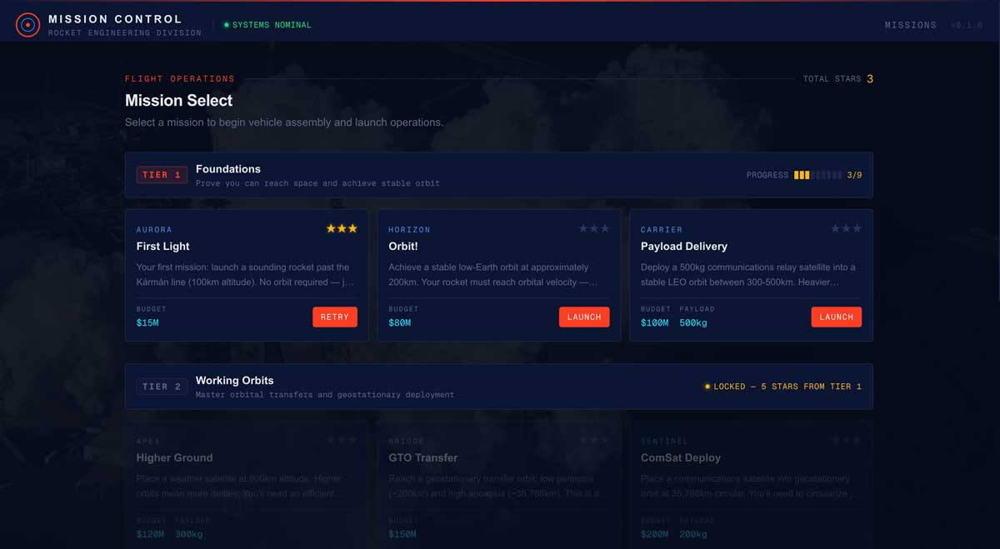

# Mission Control

**Design rockets. Master orbits. Learn the physics that took us to the Moon.**

Mission Control is a browser-based rocket engineering game where you design, build, and fly rockets to complete real space missions — from your first suborbital hop past the Karman line to interplanetary transfers to Mars and beyond.

No hand-holding. No fake physics. Just you, the rocket equation, and the unforgiving math of orbital mechanics.



## How It Works

**Pick a mission.** Each mission gives you a destination, a payload requirement, and a budget. Start simple — just get above 100km. Then work your way up to geostationary orbit, lunar transfers, and deep space.

**Build your rocket.** Choose from a catalog of engines and fuel tanks, each with real performance characteristics — thrust, specific impulse, mass, cost. Stack stages, balance your mass ratio, and watch your delta-v budget in real time. Go over budget or build a rocket that can't lift itself? You'll find out fast.

**Fly it yourself.** No autopilot. You control the throttle, pitch your gravity turn, and trigger stage separations manually. Burn too early and you waste fuel fighting drag. Turn too late and you'll never reach orbit. Time warp lets you skip the quiet parts.

**See what happened.** After every flight, a full debrief breaks down your efficiency, budget usage, and orbital accuracy. Earn up to 3 stars per mission and unlock harder tiers as you improve.

## The Physics Is Real

The simulation runs on actual orbital mechanics — the same equations NASA uses, just in your browser:

- **Tsiolkovsky Rocket Equation** — Every gram of fuel and every second of specific impulse matters
- **Keplerian Orbits** — Vis-viva equation, orbital elements computed from state vectors, Hohmann transfers
- **RK4 Numerical Integration** — Continuous trajectory propagation with gravity, atmospheric drag, and thrust
- **Exponential Atmosphere** — Drag that fades realistically with altitude
- **Inverse-Square Gravity** — No shortcuts, no flat-Earth approximations

You won't just memorize formulas — you'll develop intuition for why rockets are staged, why specific impulse matters more than raw thrust for upper stages, and why a gravity turn is the difference between orbit and a very expensive firework.

## 15 Missions Across 5 Tiers

| Tier | Name | What You'll Learn |
|------|------|-------------------|
| 1 | **Foundations** | Reach space, achieve orbit, deliver your first payload |
| 2 | **Working Orbits** | Higher orbits, GTO transfers, geostationary deployment |
| 3 | **Deep Space** | Lunar flyby, lunar orbit, landing on the Moon |
| 4 | **Interplanetary** | Trans-Mars injection, Mars orbit, surface delivery |
| 5 | **Grand Tour** | Jupiter flyby, Saturn orbit, solar escape velocity |

Each tier unlocks when you earn enough stars from the previous one. Bonus challenges on every mission reward creative solutions — like reaching orbit on solid boosters alone or coming in under half budget.

## Getting Started

```bash
npm install
npm run dev
```

Open [http://localhost:3000](http://localhost:3000) and select your first mission.

## Built With

| | |
|---|---|
| **Next.js 15** | App Router, server components, TypeScript |
| **React 19** | Latest React with concurrent features |
| **Tailwind CSS 4** | Utility-first styling with NASA-inspired design system |
| **Zustand** | Lightweight state management across builder, flight sim, and progression |
| **Custom Physics Engine** | Tsiolkovsky, Keplerian mechanics, RK4 integration — no physics library dependencies |
| **Vitest** | Unit tests verifying physics accuracy against known values (Saturn V delta-v, LEO velocities, Hohmann transfers) |
