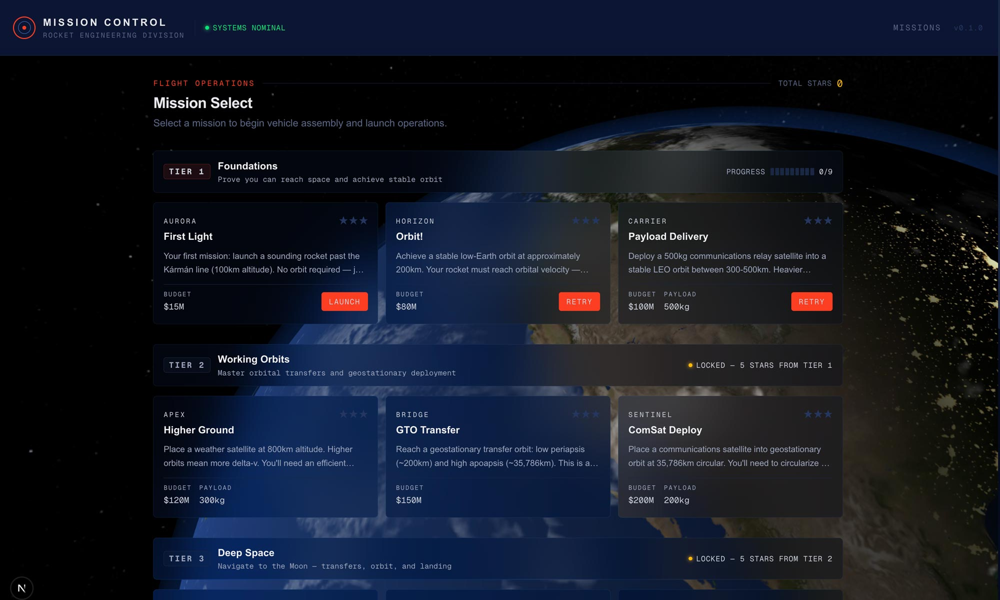
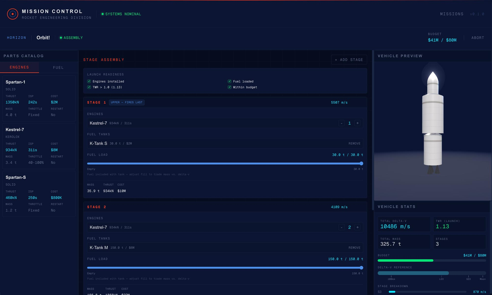
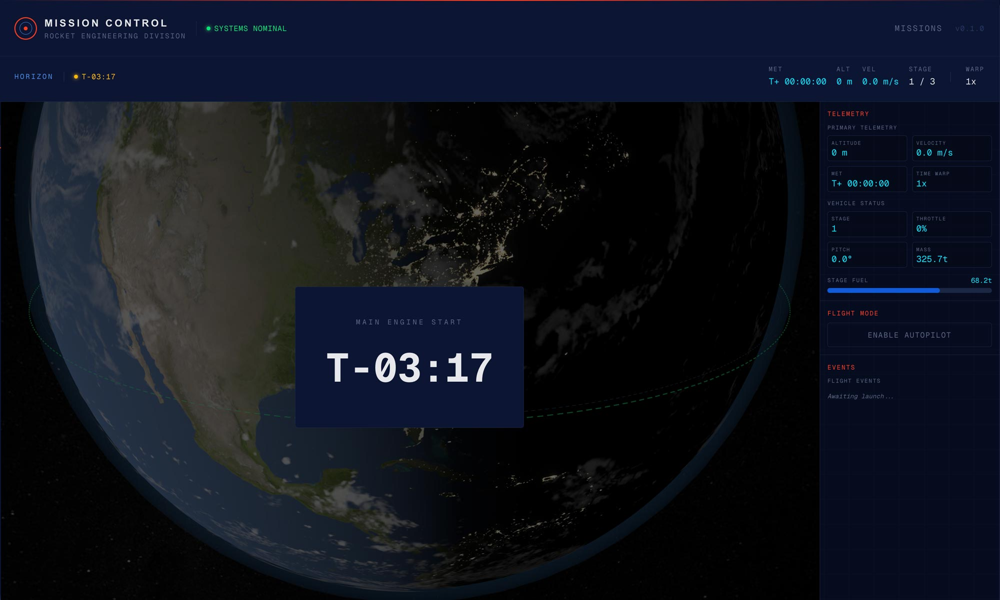
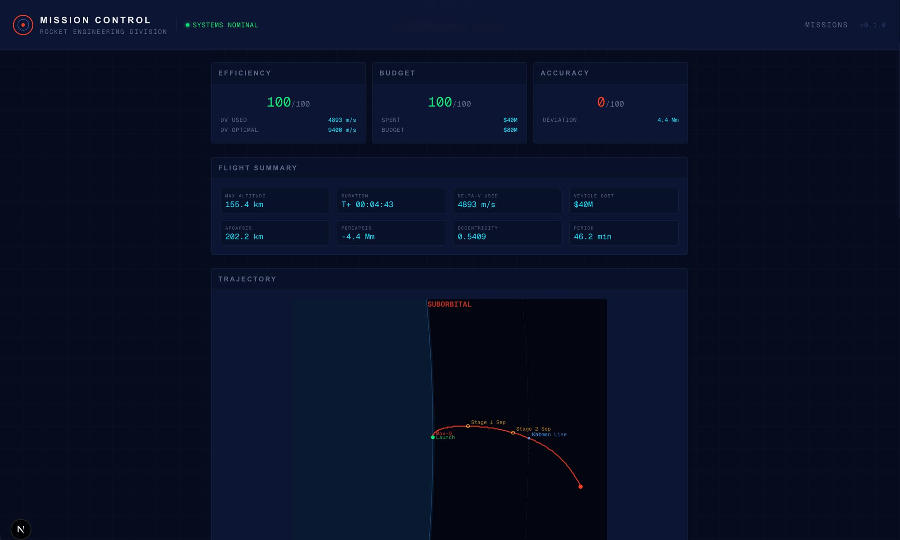

# Mission Control

**Design rockets. Master orbits. Learn the physics that took us to the Moon.**

Mission Control is a browser-based rocket engineering game where you design, build, and fly rockets to complete real space missions — from your first suborbital hop past the Karman line to interplanetary transfers to Mars and beyond.

No hand-holding. No fake physics. Just you, the rocket equation, and the unforgiving math of orbital mechanics.



## How It Works

**Pick a mission.** Each mission gives you a destination, a payload requirement, and a budget. Start simple — just get above 100km. Then work your way up to geostationary orbit, lunar transfers, and deep space.



**Build your rocket.** Choose from a catalog of engines and fuel tanks, each with real performance characteristics — thrust, specific impulse, mass, cost. Stack stages, balance your mass ratio, and watch your delta-v budget in real time. Go over budget or build a rocket that can't lift itself? You'll find out fast.



**Fly it.** Control the throttle, pitch your gravity turn, and trigger stage separations. An optional autopilot handles gravity turns and staging if you'd rather watch. Contextual flight advisories guide you through each phase — when to start pitching, when to go horizontal, when you're approaching orbital velocity. Time warp up to 10,000x lets you skip the quiet parts.



**See what happened.** After every flight, a full debrief breaks down your efficiency, budget usage, and orbital accuracy with detailed telemetry charts and a trajectory plot. Earn up to 3 stars per mission and unlock harder tiers as you improve.

## The Physics Is Real

The simulation runs on actual orbital mechanics — the same equations that govern real spaceflight, computed in your browser with no physics library dependencies.

### Rocket Propulsion

The **Tsiolkovsky rocket equation** determines how much velocity change (delta-v) your rocket can achieve:

```
Δv = Isp × g₀ × ln(m_wet / m_dry)
```

Every gram of fuel, every kilogram of structure, and every second of specific impulse matters. The equation shows why staging is essential — by discarding empty tanks, you dramatically improve your mass ratio for subsequent burns. The builder computes per-stage and total delta-v in real time so you can see exactly how your design choices affect performance.

**Mass flow rate** (`ṁ = F / (Isp × g₀)`) governs fuel consumption. **Thrust-to-weight ratio** (`TWR = F / (m × g)`) must exceed 1.0 to leave the pad. Engine performance varies between sea level and vacuum using altitude-interpolated thrust and Isp values.

### Orbital Mechanics

Orbits are computed from **Keplerian orbital elements** derived directly from position and velocity state vectors:

- **Specific orbital energy**: `ε = v²/2 − μ/r` — determines whether you're in a bound orbit or on an escape trajectory
- **Semi-major axis**: `a = −μ / (2ε)` — the "size" of your orbit
- **Eccentricity vector**: computed from the state vectors to determine orbital shape (0 = circular, 0–1 = elliptical, ≥1 = escape)
- **Periapsis and apoapsis**: `r_p = a(1−e)`, `r_a = a(1+e)` — your closest and farthest points from the body

The **vis-viva equation** (`v = √(μ × (2/r − 1/a))`) gives velocity at any point in an orbit. **Hohmann transfers** between circular orbits are computed analytically using the transfer orbit semi-major axis `a_t = (r₁ + r₂) / 2`.

**Circular orbital velocity** at radius `r` is `v = √(μ/r)` — about 7,800 m/s at low Earth orbit. **Escape velocity** is `v = √(2μ/r)` — roughly 41% more than circular velocity at the same altitude.

### Numerical Integration

Trajectories are propagated using **4th-order Runge-Kutta (RK4)** integration at a fixed 10ms timestep. Each physics step computes:

1. **N-body gravity** — inverse-square gravitational acceleration from Earth and (for Tier 3+ missions) the Moon, Mars, Jupiter, and Saturn, with positions computed from circular orbit approximations
2. **Atmospheric drag** — `F = ½ρv²CdA` using an exponential atmosphere model (`ρ = ρ₀ × e^(−h/H)`) with scale height H = 8,500m, active below 100km
3. **Thrust** — applied along the rocket's heading, which the player controls via pitch angle relative to local vertical

The RK4 method evaluates four derivative samples per step and combines them with weighted averaging (`y_{n+1} = y_n + (dt/6)(k₁ + 2k₂ + 2k₃ + k₄)`), providing 4th-order accuracy for smooth, stable trajectories even during high-thrust maneuvers.

At high time warp (>100x), the physics timestep increases to 0.1s to keep substep counts manageable while maintaining stability.

### Multi-Body Gravity & SOI

For deep space missions, the simulation tracks multiple celestial bodies with real gravitational parameters (μ = GM):

| Body | μ (m³/s²) | SOI Radius |
|------|-----------|------------|
| Earth | 3.986 × 10¹⁴ | — |
| Moon | 4.905 × 10¹² | 66,100 km |
| Mars | 4.283 × 10¹³ | 577,000 km |
| Jupiter | 1.267 × 10¹⁷ | 48,200,000 km |
| Saturn | 3.793 × 10¹⁶ | 54,500,000 km |

**Sphere of influence (SOI)** transitions are detected dynamically — when your spacecraft crosses into a body's SOI, orbital elements are recomputed relative to that body's gravitational parameter, center, and velocity. This enables lunar orbit insertion, Mars capture, and planetary flyby detection.

### Earth & Atmosphere

- Launch from the equator at Earth's surface rotation speed (465.1 m/s)
- Exponential atmosphere model with drag fading to zero at the Karman line (100km)
- Day/night Earth rendering with custom GLSL shaders — city lights emerge on the dark side using luminance-based masking

### Gravity Turn & Flight Control

The autopilot implements a **gravity turn** — a pitch profile that gradually tilts the rocket from vertical to horizontal as altitude increases. This is the same technique real rockets use to minimize gravity losses while building horizontal velocity for orbit. The pitch schedule is tuned per mission category:

- **Suborbital**: nearly vertical with slight pitch at high altitude
- **Low orbit**: gradual turn starting at ~5km, reaching horizontal by ~180km
- **Transfer**: standard LEO gravity turn, then fully prograde burn once near orbital velocity

Players can override the autopilot at any time with manual pitch and throttle control via an interactive arc gauge overlaid on the 3D flight scene.

## 15 Missions Across 5 Tiers

| Tier | Name | What You'll Learn |
|------|------|-------------------|
| 1 | **Foundations** | Reach space, achieve orbit, deliver your first payload |
| 2 | **Working Orbits** | Higher orbits, GTO transfers, geostationary deployment |
| 3 | **Deep Space** | Lunar flyby, lunar orbit, landing on the Moon |
| 4 | **Interplanetary** | Trans-Mars injection, Mars orbit, surface delivery |
| 5 | **Grand Tour** | Jupiter flyby, Saturn orbit, solar escape velocity |

Each tier unlocks when you earn enough stars from the previous one. Bonus challenges on every mission reward creative solutions — like reaching orbit on solid boosters alone or coming in under half budget.

## Getting Started

```bash
npm install
npm run dev
```

Open [http://localhost:3000](http://localhost:3000) and select your first mission.

## Built With

| | |
|---|---|
| **Next.js 15** | App Router, server components, TypeScript |
| **React 19** | Latest React with concurrent features |
| **React Three Fiber** | 3D flight visualization with Three.js — Earth, rockets, jettisoned stages, orbit paths |
| **Tailwind CSS 4** | Utility-first styling with NASA-inspired design system |
| **Zustand** | Lightweight state management across builder, flight sim, and progression |
| **Recharts** | Post-flight telemetry charts — altitude, velocity, downrange, with stage separation markers |
| **Custom Physics Engine** | Tsiolkovsky, Keplerian mechanics, N-body gravity, RK4 integration — zero physics library dependencies |
| **Custom GLSL Shaders** | Earth day/night rendering with city lights and realistic atmospheric terminator |
| **Vitest** | Unit tests verifying physics accuracy against known values (Saturn V delta-v, LEO velocities, Hohmann transfers) |
